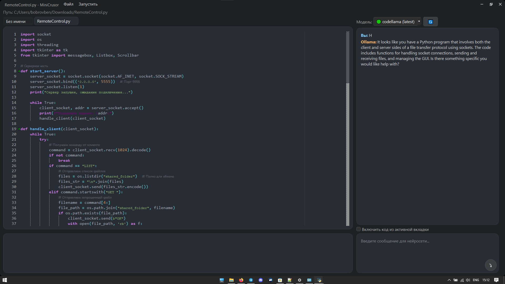

# MiniCrusor 🪶

**MiniCrusor** — это легковесный, кроссплатформенный редактор кода, написанный на Python с использованием PyQt5. Он создан как минималистичная альтернатива современным IDE и предоставляет базовые инструменты для написания кода, его запуска и взаимодействия с локальными AI-моделями через [Ollama](https://ollama.com/).


## ✨ Возможности

- **Редактор кода с подсветкой синтаксиса**: Построен на основе `QScintilla` с поддержкой Python, нумерацией строк и автодополнением.
- **Вкладочный интерфейс**: Работайте с несколькими файлами в одном окне.
- **Встроенный AI-чат**: Интеграция с локально запущенным сервисом Ollama.
  - Выделяйте код и задавайте вопросы нейросети.
  - Используйте код из активной вкладки как контекст для ваших запросов.
  - Получайте и применяйте кодовые предложения от AI одним кликом.
  - Управляйте локальными моделями Ollama: скачивайте, обновляйте и переключайтесь между ними прямо из интерфейса.
- **Встроенная консоль**: Запускайте свои Python-скрипты и просматривайте их вывод в реальном времени.
- **Кастомный интерфейс**: Бесшовное окно без стандартных рамок ОС с кастомным заголовком.
- **Базовые файловые операции**: Открытие, сохранение (в том числе "Сохранить как...") и создание новых файлов.



## 🛠️ Установка и запуск

### Требования
- **Python 3.7+**
- **[Ollama](https://ollama.com/)**: Для работы AI-чата необходимо, чтобы сервис Ollama был установлен и запущен на вашем компьютере.
- **AI-модель**: хотя бы одна скачанная модель (например, `llama3`, `codellama` или `phi3`).

### Шаги установки

1. **Клонируйте или скачайте репозиторий**
   ```bash
   git clone https://github.com/your-username/MiniCrusor.git
   cd MiniCrusor
   ```
   Или просто скачайте файлы `MiniCrusor.py` и `requirements.txt`.

2. **Установите зависимости Python**
   Откройте терминал или командную строку в папке с проектом и выполните команду:
   ```bash
   pip install -r requirements.txt
   ```

3. **Установите и запустите Ollama**
   - Перейдите на официальный сайт [ollama.com](https://ollama.com/) и следуйте инструкциям по установке для вашей операционной системы (Windows, macOS, Linux).
   - После установки убедитесь, что сервис Ollama запущен. Обычно он работает в фоновом режиме.

4. **Скачайте AI-модель (через терминал или интерфейс)**
   Вы можете скачать модель либо через терминал:
   ```bash
   ollama pull phi3
   ```
   Либо запустить MiniCrusor и скачать модель через его графический интерфейс.

## ▶️ Запуск приложения
После выполнения всех шагов запустите скрипт:
```bash
python MiniCrusor.py
```

## 📝 Как пользоваться AI-чатом

- **Выберите модель**: В выпадающем списке выберите одну из доступных моделей. Если модель не скачана (отмечена красным кружком 🔴), нажмите кнопку "⬇️", чтобы начать загрузку.
- **Задайте вопрос**: Напишите свой вопрос в поле ввода.
- **Добавьте контекст**: Установите галочку "Включить код из активной вкладки", чтобы отправить содержимое текущего файла вместе с вашим вопросом.
- **Отправьте сообщение**: Нажмите кнопку отправки (⤵️) или `Enter`.
- **Работа с кодом**:
  - Чтобы спросить что-то о конкретном участке кода, выделите его в редакторе, кликните правой кнопкой мыши и выберите "Спросить у нейросети".
  - Если нейросеть предложила блок кода в своем ответе, появится кнопка "Применить предложенный код", которая заменит содержимое активной вкладки на предложенный код.

---
Проект создан для демонстрации возможностей PyQt5 и интеграции с локальными AI. Не стесняйтесь вносить свой вклад и улучшать его!
